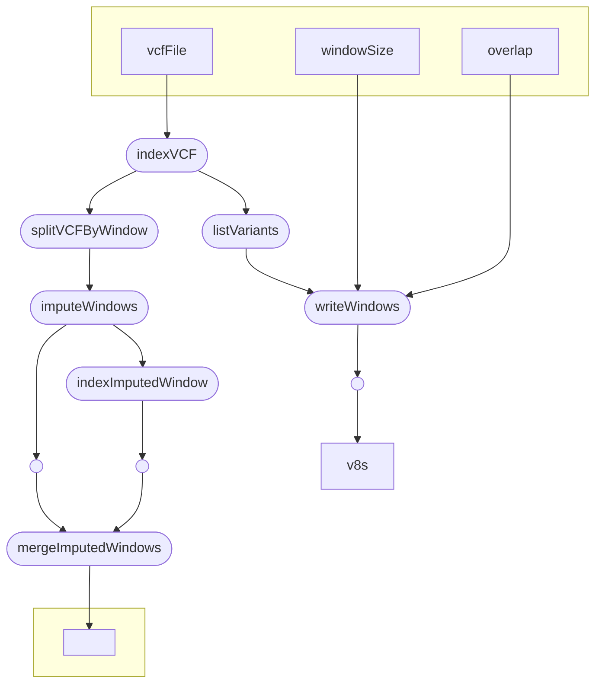

# DivImpute

This workflow is implemented to perform a genotype imputation using the Beagle Imputation Software. It splits the VCF into overlapping windows that are imputed independant from another and merged into one VCF afterwards.

# Citations
