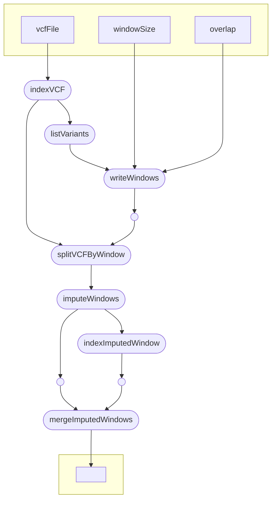

# DivImpute

This workflow is implemented to perform a genotype imputation using the Beagle [1] Imputation Software. It splits the VCF into overlapping windows that are imputed independant from another and merged into one VCF afterwards.

# Citations

Feser, Manuel, König, Patrick, Fiebig, Anne, Arend, Daniel, Lange, Matthias and Scholz, Uwe. "On the way to plant data commons – a genotyping use case" Journal of Integrative Bioinformatics, vol. 19, no. 4, 2022, pp. 20220033. https://doi.org/10.1515/jib-2022-0033

A list of publications of standards and tools used with this workflow can be found here: 

[1] B L Browning, Y Zhou, and S R Browning (2018). A one-penny imputed genome from next generation reference panels. Am J Hum Genet 103(3):338-348. doi:10.1016/j.ajhg.2018.07.015
